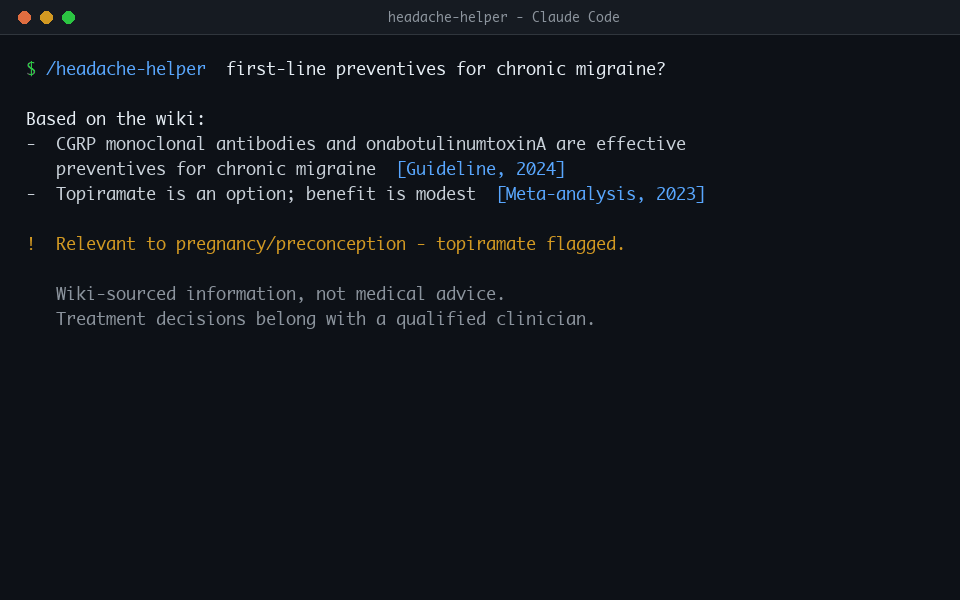

# Headache Helper

**A Claude Code plugin for answering headache & migraine questions that refuses to make things up.**

<p align="center">
  <a href="assets/demo.gif"></a>
  <br>
  <sub>Animated demo (loops). Not seeing motion — e.g. in email? Here's the <a href="assets/demo.png">static screenshot</a>.</sub>
</p>

Headache Helper answers your questions *only* from a curated local wiki of peer-reviewed papers, clinical guidelines, and neurology reference texts that **you approve** — with inline citations, source-conflict resolution, and a hard no-fabrication rule. If the wiki doesn't cover something, it says so and offers to research it. It never answers from the model's general knowledge.

It ships two skills:

- **`/headache-helper`** — asks the wiki and answers (read-only, safe).
- **`/headache-ingest`** — fetches candidate sources from a trusted whitelist, drafts them, and adds them to the wiki **only after you approve** (the write path, gated).

> ⚠️ **Not medical advice.** This is a research and knowledge-management tool. Its answers are summaries of the sources *you* curated — not clinical guidance. Treatment decisions belong with a qualified clinician. You are responsible for the sources you ingest and how you use the output.

---

## Why this exists

Large language models are useful but they **hallucinate** — and residual hallucination persists even in clinically-tuned models (a published example: an RLHF-tuned diagnostic model still produced incorrect outputs ~2% of the time). For anything health-related, a plausible-but-wrong answer is worse than no answer.

Headache Helper's premise is simple: **grounding, not model quality, is what makes an answer trustworthy.** So it inverts the usual flow — instead of asking the model what it "knows," it asks a curated corpus of real, cited, maintainer-approved sources and forbids the model from going beyond them.

---

## Key features

- **Grounded-only answers.** Every claim traces to an approved source file, cited inline as `[title, year]`. No source, no claim.
- **Never fabricates or hedges.** If the wiki doesn't cover it, the skill says "the wiki doesn't cover this yet" and offers to ingest it — it won't guess, and it won't soften an ungrounded statement into "might/possibly/some sources suggest."
- **Tiered trust whitelist.** Only guidelines/classification (Tier 1), peer-reviewed literature (Tier 2), and reference texts/registries (Tier 3) can enter. Preprints, blogs, marketing, and social media are hard-blocked.
- **Recency-wins-within-tier conflict resolution.** When sources disagree, the higher evidence tier wins first; among equals, the newer one wins — and the answer says when it applied this.
- **Human approval gate.** Fetched sources land in `pending/` and never enter the answerable wiki without your explicit approval.
- **Re-validation safeguard.** Every answer is logged with the exact sources it used. When you ingest new material, the plugin re-checks past answers and flags any that a newer/higher-tier source has changed — so guidance can't quietly drift.
- **Personal headache history.** On first run the plugin sets up `HEADACHE-HISTORY.md` — your private journal of questions asked, treatments tried, and attack entries. Answers use it as context about *you* (never as medical evidence), and it stays on your computer.
- **Running bibliography.** A `CITATIONS.md` of every source, DOI-linked and grouped by topic, is kept current automatically.
- **Rejection audit trail.** Every source the gate refuses is logged with a reason, so you have a durable record of what was excluded and why.
- **Standing disclaimer** on every answer.

---

## How it works

```
                 you ask ─────────────► /headache-helper ──► reads headache-wiki/ ──► cited answer
                                                │                                        │
                                                └──── logs Q + sources ──► ANSWER-LOG.md ◄┘

  you request a topic ──► /headache-ingest ──► whitelist gate ──► pending/ ──► YOU APPROVE ──► wiki/
                                                     │                                          │
                                              REJECTED.md ◄─ off-whitelist            INDEX.md + CITATIONS.md
                                                                                        + re-validate ANSWER-LOG
```

The wiki is plain Markdown — **one file per source** with a metadata header (`tier`, `year`, `source_type`, `doi`, `topics`, `approved_by`, …) plus a fixed-format summary body. Because the metadata is structured, conflict resolution is a mechanical lookup rather than a judgment call. See [`knowledge/DESIGN.md`](knowledge/DESIGN.md) for the full data contract.

---

## Installation

> **New to all of this?** This section assumes you've never installed a plugin — or Claude Code itself — before. Follow it top to bottom and you'll be fine. It takes about ten minutes.

### Step 0 — What you're installing, in plain terms

- **Claude Code** is a free tool from Anthropic that lets you talk to Claude (an AI assistant) from your computer's **terminal** — the app that lets you type commands to your computer. You'll install it once.
- A **plugin** adds new abilities to Claude Code. Headache Helper is a plugin.
- A **skill** is one of those abilities. This plugin adds two: one that answers questions (`/headache-helper`) and one that adds new research to your library (`/headache-ingest`). You run a skill by typing its name with a slash in front of it, like `/headache-helper`.
- A **wiki** here just means a folder of research summaries on your own computer. Nothing is shared online.

You do **not** need to know how to code. You'll copy and paste a few commands.

### Step 1 — Open your terminal

- **Mac:** Press `Cmd + Space`, type `Terminal`, press Enter. A window with a text prompt opens.
- **Windows:** Open the Start menu, type `PowerShell`, press Enter.
- **Linux:** Open your **Terminal** app.

Anything shown in a grey code box below is meant to be **typed (or pasted) into this window, then run by pressing Enter.**

### Step 2 — Install Claude Code (skip if you already have it)

If you've never used Claude Code, follow the official installation guide here: **[claude.com/claude-code](https://claude.com/claude-code)**. It walks you through installing it and signing in with your Anthropic account.

To check whether it's already installed, type this and press Enter:

```bash
claude --version
```

- If you see a version number (like `1.2.3`), you're good — go to Step 3.
- If you see `command not found`, Claude Code isn't installed yet. Use the guide linked above, then come back.

### Step 3 — Start Claude Code

In your terminal, type:

```bash
claude
```

Press Enter. The prompt changes — you're now **inside Claude Code**. From here on, the commands that start with a slash (`/`) are typed at *this* Claude Code prompt, **not** the plain terminal.

> **How to tell the two apart:** commands starting with `/` (like `/plugin`) go to the Claude Code prompt. Commands like `cp` or `git` (no slash) go to a plain terminal. When in doubt, this README labels each one.

### Step 4 — Install the plugin

At the Claude Code prompt, type these two lines, pressing Enter after each:

```
/plugin marketplace add GenkiTaco/headache-helper
```

```
/plugin install headache-helper
```

The first line tells Claude Code where to find this plugin (my public GitHub repo). The second line installs it. If it asks you to confirm, say yes. That's it — the plugin is installed.

> **Prefer to do it by hand?** You can instead clone the repo in a plain terminal with `git clone https://github.com/GenkiTaco/headache-helper.git` and copy the two folders inside `skills/` into your `~/.claude/skills/` directory. The marketplace method above is easier and is recommended.

---

## Setup — create your wiki (one time)

> **Good news — the plugin now does this for you.** The first time you run `/headache-helper` or `/headache-ingest` in a folder with no wiki, the skill offers to create `headache-wiki/` from the shipped template and then interviews you to set up your personal **`HEADACHE-HISTORY.md`** — a private file that tracks your questions, your treatments, and your experiences over time (it stays on your computer, and it's context for answers, never a medical source). You can simply skip ahead to [Usage](#usage) and let the first run walk you through it.
>
> The manual steps below do the same thing by hand — kept for reference, and for when you want to control exactly where everything goes.

The plugin comes with an **empty** starter library in a folder called `knowledge/`. You need to make your own copy of it — named `headache-wiki/` — inside the folder where you want to keep your research. This is where your approved sources will live.

### Step 1 — Pick and open a folder

Decide where you want your wiki to live — for most people a new folder in Documents is perfect. In a **plain terminal** (not the Claude Code prompt), create one and move into it. For example:

```bash
mkdir ~/Documents/headaches
cd ~/Documents/headaches
```

`mkdir` makes the folder; `cd` ("change directory") moves you into it. From now on, this is your **project folder** — the place Claude Code will look for your wiki.

### Step 2 — Copy the starter library into it

The marketplace installer keeps its copy of the plugin under `~/.claude/plugins/cache/`. Copy the starter library from there into your project folder with this one command:

```bash
cp -R ~/.claude/plugins/cache/headache-helper/headache-helper/*/knowledge/ ./headache-wiki/
```

`cp -R` means "copy a whole folder and everything inside it." The `*` in the middle just stands in for the version number, so this keeps working after updates. This creates a `headache-wiki/` folder right where you are.

> **If that command can't find the folder** (you see "No such file or directory"), you installed manually instead. Just find the `knowledge/` folder inside wherever you cloned the repo, and copy it — e.g. `cp -R /path/to/headache-helper/knowledge/ ./headache-wiki/`.

You should now have this inside your project folder:

```
headache-wiki/
├── DESIGN.md             # the rulebook for how sources are stored (don't need to read it)
├── _TEMPLATE.md          # the blank form each source is filled into
├── INDEX.md              # a table of every source (kept up to date for you)
├── CITATIONS.md          # a running bibliography (kept up to date for you)
├── ANSWER-LOG.md         # the system's record of answers, for re-validation
├── HEADACHE-HISTORY.md   # YOUR file: your questions, treatments, and experiences
├── wiki/                 # your approved sources live here (starts with one EXAMPLE file)
└── pending/
    └── REJECTED.md       # a log of sources that were rejected, and why
```

### Step 3 — Delete the example file

The `wiki/` folder ships with a single placeholder called `EXAMPLE-entry.md` so you can see the format. Delete it so it doesn't clutter real answers:

```bash
rm headache-wiki/wiki/EXAMPLE-entry.md
```

Your wiki now starts empty and ready. You'll fill it up in the next section.

> **Where does the wiki have to be?** The skills automatically look for a folder named `headache-wiki/` in whatever project folder you're in when you start Claude Code. As long as you launched `claude` from the folder that contains `headache-wiki/`, it just works. If you keep your wiki somewhere else, simply tell the skill the path when you run it (e.g. "use the wiki at ~/Documents/headaches/headache-wiki").

---

## Usage

> **Every time you want to use it:** open a plain terminal, `cd` into your project folder (the one that contains `headache-wiki/`), and run `claude` to start Claude Code. Then type the slash-commands below at the Claude Code prompt. For example:
> ```bash
> cd ~/Documents/headaches
> claude
> ```

**Add sources to a topic** (nothing enters the wiki without your OK):

```
/headache-ingest preventive treatment of chronic migraine
```

The skill queries whitelisted databases (e.g., PubMed), rejects anything off-whitelist (logging why), drafts candidate entries into `pending/`, and shows you a summary table. You reply with which to approve; approved sources move into `wiki/` and the index, citations, and answer-log update automatically.

**Ask a question:**

```
/headache-helper What does the evidence say about CGRP antibodies for chronic migraine prevention?
```

A grounded answer, every claim cited to a wiki file, with the standing disclaimer — or a plain "the wiki doesn't cover this yet" if it doesn't.

---

## The source whitelist (trust boundary)

| Tier | What's allowed | Examples |
|------|----------------|----------|
| **1** | Clinical guidelines & classification | ICHD-3, AHS, AAN, EHF, EAN, NICE |
| **2** | Peer-reviewed literature | Cochrane, PubMed/MEDLINE; Cephalalgia, Headache, J Headache Pain, Neurology, Lancet Neurology, JAMA Neurology, Brain, Nat Rev Dis Primers/Neurology |
| **3** | Reference texts & registry | Neurology textbooks, UpToDate (manual); ClinicalTrials.gov (status only) |

**Hard-blocked:** bioRxiv/medRxiv preprints, general web/blogs/news/Wikipedia, forums/social media, supplement & clinic marketing, anything generated from the model's training, and topically-adjacent-but-wrong-type sources. Every rejection is logged.

Edit the whitelist in `knowledge/DESIGN.md` (§4) and the ingest skill to match your own trust boundary.

---

## Design principles

1. **No source, no claim.** The model may not exceed the wiki.
2. **Whitelist at the door.** Trust is decided before a source is ever summarized.
3. **Recency-wins-within-tier.** Conflicts resolve mechanically and transparently.
4. **Human approval gate.** You decide what counts as authoritative.
5. **Log and re-validate.** New evidence surfaces any past answer it changes.

Full rationale and the complete data contract: [`knowledge/DESIGN.md`](knowledge/DESIGN.md).

---

## Extending it

- **Other headache types / topics:** just `/headache-ingest` them — the wiki grows one approved source at a time and organizes by `topics`.
- **A different domain entirely:** the pattern (tiered whitelist → approval gate → grounded-only Q&A → re-validation) is domain-agnostic. Swap the whitelist journals/guidelines in `DESIGN.md` and the ingest skill, and you have a grounded assistant for any evidence-based field.

---

## A note on sources & copyright

This repository ships **only the framework** — the skills, the design, and an empty wiki. It does **not** include anyone's curated source corpus. When you ingest sources, you create local summaries with citations for your own reference; respect the copyright and terms of the works you summarize, and cite them properly.

---

## License

MIT — see [LICENSE](LICENSE).

Built with [Claude Code](https://claude.com/claude-code).
